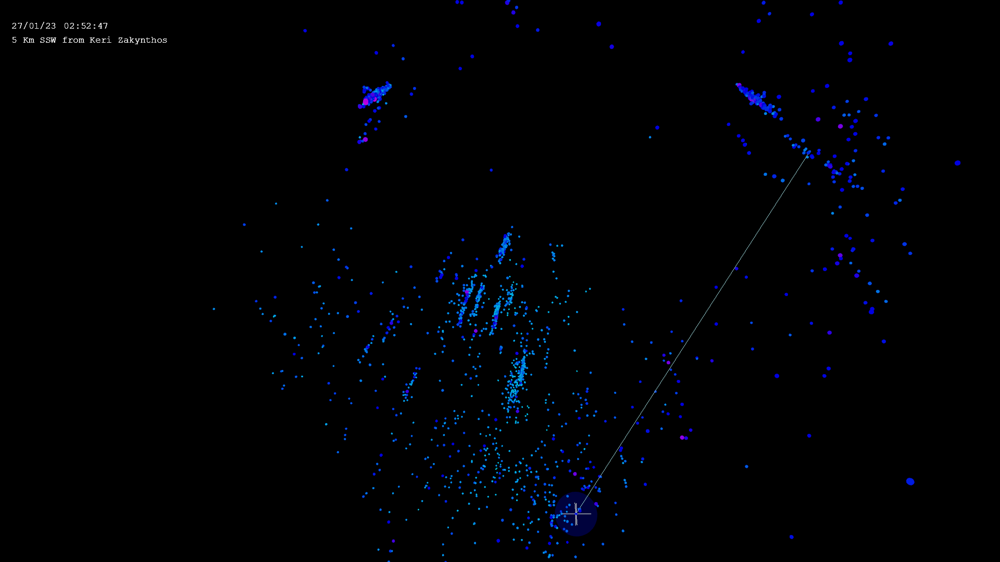
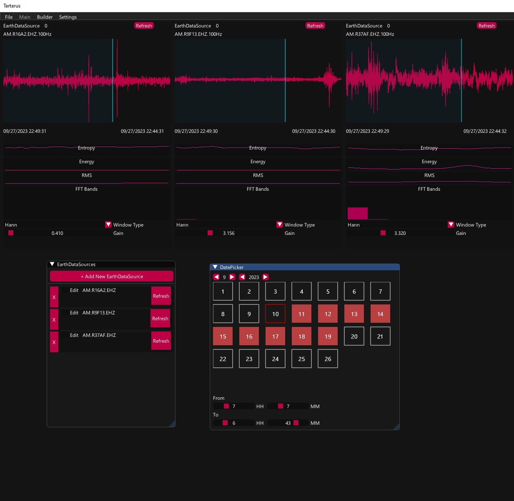
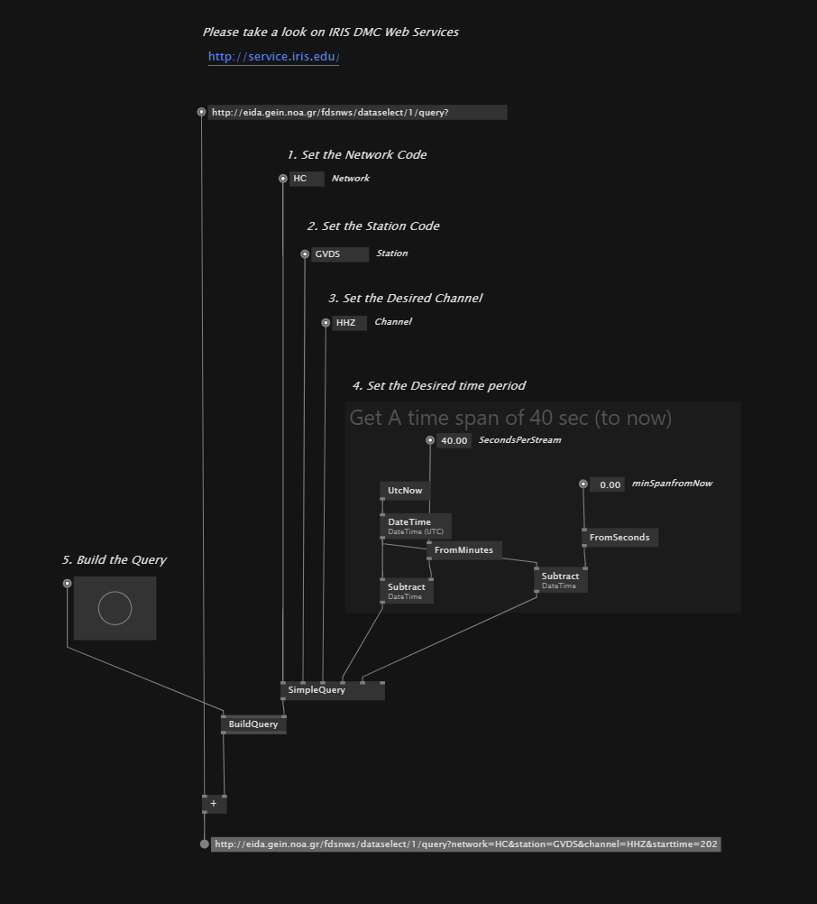
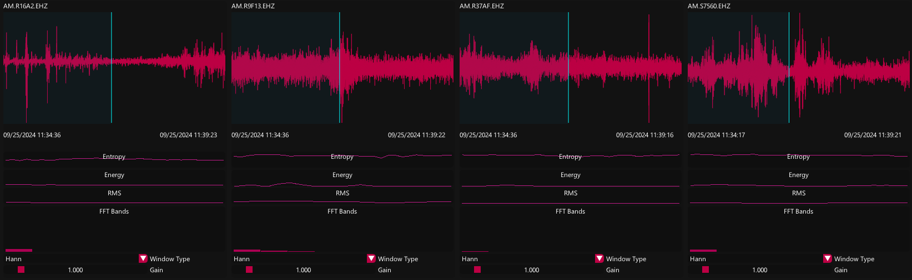
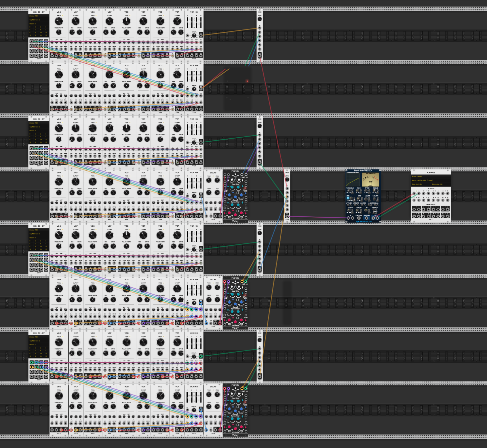

# ADA_135 C NISIDIS AVA.ADA 2207
Personal repository for course ADA_135 at Ionian University

## Preface
In recent years, I have been deeply concerned about seismic activity in Greece. My enduring fascination with the awe-inspiring yet unpredictable and destructive nature of earthquakes led me to embark on an experiment: to transform this phenomenon into a source of controlled randomness, a consistent randomness that vividly portrays chaos.

My journey began with visualizing seismic events, particularly earthquakes, with the ambition of identifying visual patterns and uncovering the hidden dynamics beneath the Earth's surface. As I scrutinized the data and the colorful dots in the three-dimensional virtual space, I couldn't help but feel compelled to do more—to listen to them, to imagine the sounds they might produce, and to experience their sensations.

As a next step, I began exploring the possibility of sonifying this data with the ultimate goal of presenting it in an interactive installation.

To accomplish this goal, I had to extensively study the phenomenon of earthquakes, the methods used to record them, and their geological significance.

Below I will list the steps and methods I followed, the tools I used or had to make for this purpose.

## Visualization and Sonification of Seismic Activity

This attempt consists of two distinct parts. In **Part I** (Lithosphere), we represent earthquakes as points in space, and in **Part II**, we discuss the possibility of directly sonifying data streams from seismographs.

***
## Part I: Lithosphere

<cite>Earthquakes as point-clouds</cite>

On the first part the goal is to visualize and represent seismic events (earthquakes) in the 3d or 2d space as a pointcloud.

||
|:--:|
|<small>*Youtube Video [Lithosphere](https://youtu.be/JKl6PjuqT88)*</small>|

##### Earthquake Event Keypoints:

- Location <small>(Longtitude & Lattitude)</small>
- Magnitude <small>(Richter)</small>
- Depth <small>(km)</small>
- DateTime <small>(UTC)</small>

In the current version of this project, each point inherits the properties of the corresponding earthquake event and also possesses the necessary properties and methods to visualize and sonify it.

#### Ways to Interpret and Correlate the data:

- Linearly with a fixed interval, each point is being added or lighten up after the other ignoring the time difference or the actual distance.
- Linearly with a fixed time interval, each point is added or illuminated after the other, ignoring the time difference or the actual distance.
  <small><i>Specifically, if we assume that event A occurs at t0 and event be at t1 then the interval is t0-t1. By this means it is expected to result in an output which has its own internal rhythm.</i></small>
- Non-linear using the centroids of the individual clusters. Events are separated into clusters using the Kmeans algorithm. By self-organizing the points based on their internal criteria it allows us to observe them in parallel threads, simultaneously.

##### Visualization Method

In the current application, the *saturation* of color represents the time of appearance, the hue of color represents the ratio of *magnitude* to *depth* (intensity), and the *magnitude* represents the size (radius) of each point, respectively.

##### Sonification Method

- Time distance is translated to the time interval for the MIDI triggers.
- Depth affects the tone (frequency)
- Magnitude affects the velocity
- and Location (physical distance among the events) is being transcribed to Reverb wetness.  

***
## Part II : TARTARUS

A Seismic Signal Processing Application for Artistic Visualization and Sonification

||
|:--:|
|<small>*Youtube Video [Tartarus POC](https://www.youtube.com/watch?v=J7XCLp2m_o0)*</small>|

<small><i>In Greek mythology, Tartarus is a term that refers to both a deity and a location. Tartarus is often described as a deep, gloomy, and abyssal abyss or pit within the underworld, where the most wicked and monstrous beings are imprisoned for eternity. It's a place of punishment and confinement for those who have committed heinous crimes or defied the gods.</i></small>

### Introduction

In this section, our goal is to sonify data by accessing a continuous stream derived from specific stations around the world. 

The inspiration for this idea comes from an audio experience where the listener stands in the center of a room surrounded by speakers. 

Tartarus has the capability to retrieve information from seismographic devices via the IRIS network and FDSN. It can receive the streams, typically transmitted in the 'miniSEED' file format, process them, and convert them into envelopes for the purpose of driving acoustic oscillators.

### Presentation

The inspiration for this idea comes from an audio experience where the listener stands in the center of a room surrounded by speakers. 

A potential scenario for exhibiting Tartarus involves a room equipped with a minimum of four speakers, strategically placed around the audience. Each speaker corresponds to a distinct point on the horizon and, in actuality, represents a real seismographic device. The entire experience is designed to provide an acoustic glimpse of what it would be like to listen to the Earth's natural rhythms and vibrations.

## How it works
### Phase A. Retrieve Data Sources

This section is generally more complex than Part II as the data is not always publicly available, making it difficult to obtain. However, the good news is that most of the data we need can be accessed through various networks depending on their location and the organization or institution that manages them.

By setting and pushing simple queries with this [builder](http://eida.gein.noa.gr/fdsnws/dataselect/1/builder) we are capable to retrieve useful data from the NOA (National Observatory of Athens) or directly acquiring data through the FDSN[^1] via IRIS[^20].

|  |
|:--:|
| <small>*Above: Build a query with VL.Earth*</small> |

### Phase B. Acquire Data
Initially, seismographs use the SEED format for exchanging seismic data (this is very depended on the sensors and the type of the data we request). 

Depending on the channels of the device we may have access to different streams of data. 

#### Typical channel arrangements used by a GSN system:
  
| Channel | Description |
|-:|:-|
|EHZ/EHN/EHE|Short Period 100 sps|
|BHZ/BHN/BHE|Broad Band 20 sps|
|LHZ/LHN/LHE|Long Period 1 sps|
|VHZ/VHN/VHE|Very Long Period 0.1 sps|
|BCI|Broad Band Calibration Signal|
|ECI|Short Period Cal|
|LOG|Console Log|
|ACE|Administrative Clock Error|
|LCQ|1hz Clock Quality|
|OCF|Opaque Configuration File|

For realtime data exchange, there is a subversion of SEED[^10] called MiniSEED, which comes in different flavors, depending on the nature of the data and the capabilities of each Station[^5]

    So far the most comon type of MiniSEED seems to be the STEIM2 compression.

### Phase C. Rectify and Resample Acquired Data

|  |
|:--:|
| <small>*Screenshot: TARTARUS App, visualize signals from different stations on Raspberry Shake Network[^30]*</small> |

According to the table (see below) and addtionally to the previous table (channels), there is a way to understand and identify sampling rates.

    EHZ : 80 samples/sec (E) on a high-gain seismometer (H) measuring the vertical displacement (Z).

|Symbol|Description|
|:-:|-|
|**Sample Rate Prefix**||
|E|greater than 80 samples=s(including 100 and 200 samples/s)|
|S|10–80 samples=s|
|H|greater than 80 samples=s(broadband)|
|B|from 10 to 80 samples=s|
|L|1 samples=s|
|V|0:01 samples=s|
|**Instrument code**||
|H|high-gain seismometer|
|L|low-gain seismometer|
|G|gravimeter|
|M|mass position|
|N|accelerometer|
|P|geophone|
|D|pressure|
|**Orientation**||
|-|-:|
|Z, N, E|traditional vertical, north–south, east–west|
|T, R|transverse and radial|
|1, 2, 3|orthogonal with nontraditional orientation|

Upsampling from 100Hz to 48kHz, antialising order:15
no IFRs were applied

Listen to an audible test on [soundcloud](https://soundcloud.com/cnisidis/earthquake-stream)

### Phase D. Render Data to Audio

There are several methods to convert a barely audible signal to an audio signal. One approach is upsampling, which can increase the range resolution by spreading out the data across the entire spectrum. Another option is to use pitch shifting with algorithms such as PSOLA or other OLA algorithms. However, I have decided to opt for a simpler, less precise method that is more artistically interesting - using the signal envelope.

Process of creating the envelopes:
- Obtain the STFT of the signal (Hann or Gaussian window prfered).
- Map and clamp the FFT bands.
- Send the mapped and clamped bands as envelopes through MIDI.
- Use these envelopes as input in VCV Rack or your favorite DAW.

Even though the signal's sampling rate is 100 sps (100Hz) in our example, we are still able to read it and obtain its STFT Spectrum. This allows us to generate new envelopes that can be used to drive oscillators.

For the time being, we will create our oscillators in VCVRack, although any other digital audio workstation (DAW) or programming language such as PD, MAX/MSP, or SuperCollider can also be used.

|  |
|:--:|
| <small>*In the example above, I am using 8 FFT bands to generate envelopes, which will drive 8 different oscillators (per Stream). Each oscillator is tuned in such a way that it maintains the average range of each band on the audible spectrum.*</small> |

***
[References & Bibliography](REFERENCES.MD)

[^1]: [International Federation of Digital Seismograph Networks](http://www.fdsn.org/)
[^5]: Station: Every potential seismographic device which respects the FDSN convention. A Station has some standard characteristics such as a code, a channel, a network and a location.
[^10]: [miniSEED](https://ds.iris.edu/ds/nodes/dmc/data/formats/miniseed/)
[^20]: [IRIS](http://service.iris.edu/)
[^30]: [Raspberry Shake Network](https://raspberryshake.org/)
